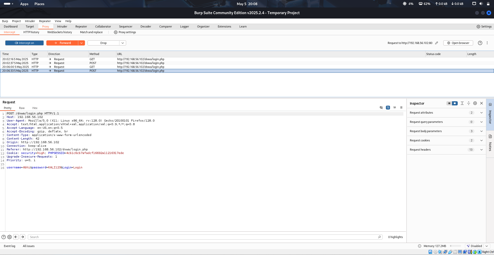

# 🔐 Vulnerability Assessment Lab (Kali Linux + Metasploitable2)

This project simulates ethical hacking in a controlled environment using Kali Linux tools on a vulnerable Metasploitable2 target.

## 🔧 Tools Used
- Kali Linux
- Metasploitable2
- Nmap
- Nikto
- Metasploit
- Burp Suite

## 📸 Screenshots

### Nmap Scan

### Nikto Scan

### Metasploit Access

### Burp Suite Interception

## ⚠️ Disclaimer
For educational use only in a lab environment.
